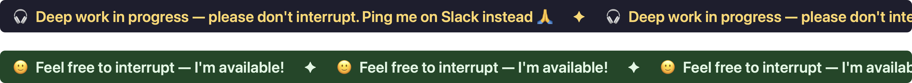

# DisturbMiNot 🎧

**A scrolling status banner for the top of your Mac's screen — so your
coworking space knows when to leave you alone, and when to come say hi.**



DisturbMiNot pins a marquee above all your windows, on every Space and every
display. It's completely click-through — it never steals your mouse or
keyboard — and it's controlled from a tiny menu bar icon. One keystroke flips
you between *"do not disturb"* and *"interruptions welcome."*

- 🖥 **Native & tiny** — one Swift file, zero dependencies, ~250 KB app
- 🚦 **Two modes** — Focus and Available, each with its own message and colors
- 🎨 **Fully customizable** — font, size, colors (with transparency), height,
  speed, display — all live from one Settings window
- ✨ **Optional eye candy** — neon glow and CRT scanlines
- 📌 **Territorial mode** — optionally pushes other windows down so nothing
  ever covers the banner
- 💾 **Remembers everything** — settings persist across launches

## Install

1. Grab `FocusBanner-x.y.z.zip` from the [Releases page](../../releases)
   and unzip it.
2. Drag `FocusBanner.app` to `/Applications` (or anywhere).
3. **First launch only:** the app isn't notarized, so right-click it →
   **Open** → **Open**. (Or clear the quarantine flag:
   `xattr -d com.apple.quarantine FocusBanner.app`)

The banner appears immediately and a text-cursor icon shows up in your menu
bar. Requires macOS 13+.

## Using it

Click the menu bar icon:

| Menu item | What it does |
|---|---|
| **Focus — Do Not Disturb** (⌘1) | Switch to the "leave me alone" banner |
| **Available — Interruptions Welcome** (⌘2) | Switch to the "come say hi" banner |
| **Settings…** (⌘,) | Open the settings window |
| **Pause Scrolling** (⌘P) | Freeze / unfreeze the marquee |
| **Quit** (⌘Q) | Remove the banner and the icon |

### Settings window

Everything lives in one window, every change applies **live** and is saved
instantly:

| Setting | Range |
|---|---|
| Message | Per mode — the banner updates as you type |
| Colors | Per mode — text & background wells, alpha supported |
| Font | Any installed font, via the macOS font panel |
| Font size | 10–48 pt slider |
| Bar height | 20–80 px slider (auto-grows if the font needs it) |
| Scroll speed | 30–300 px/s slider |
| Screen | All displays, or a single one by name |
| Glow | Neon halo around the text, tinted to the text color |
| CRT effect | Steady horizontal scanlines (no flicker) |
| Keep windows below | Nudges overlapping windows down below the banner |

> **Note on "Keep windows below":** macOS has no public API for reserving
> screen space, so this works through the Accessibility API — the first time
> you enable it, macOS asks you to allow the app under
> *System Settings → Privacy & Security → Accessibility*. Windows overlapping
> the banner are moved down every half second; full-screen apps are left
> alone.

### Settings file

Everything is stored in `~/.config/focusbanner.json`. Delete it to reset to
factory defaults. Command-line flags (below) override saved values at launch.

## Build from source

The only requirement is the Xcode Command Line Tools
(`xcode-select --install`):

```sh
git clone https://github.com/GuillaumePoly/disturbminot.git
cd disturbminot
./build.sh          # compiles banner.swift → FocusBanner.app
open FocusBanner.app
```

Other tooling:

- `make-icon.swift` — regenerates `AppIcon.icns`
- `make-preview.swift` — regenerates the README image (`docs/preview.png`)

## Command line (optional)

The binary inside the bundle accepts a Focus-mode message and startup flags:

```sh
FocusBanner.app/Contents/MacOS/focusbanner "In a call until 3pm" \
    --height 40 --font-size 20 --bg FFFFFF --fg CC0000 --speed 60
```

| Flag | Default | Meaning |
|---|---|---|
| `--speed` | `100` | Scroll speed in px/second |
| `--height` | `30` | Bar height in px |
| `--font-size` | `16` | Text size in points |
| `--bg` | `1E1E2E` | Focus background color (hex) |
| `--fg` | `FFD866` | Focus text color (hex) |

Precedence: built-in defaults < saved settings < command-line flags.

## How it works

The banner is a borderless `NSWindow` at `.statusBar` level with
`ignoresMouseEvents`, placed just below the menu bar on each screen
(`canJoinAllSpaces` + `fullScreenAuxiliary` make it follow you everywhere).
The marquee is two wide labels leapfrogging each other at 60 fps. "Keep
windows below" combines `CGWindowList` (to find overlapping windows cheaply)
with the `AXUIElement` API (to move them). Everything is in
[banner.swift](banner.swift) — ~700 lines, no dependencies.

## Releasing a new version

1. Bump `VERSION` in `build.sh`, run `./build.sh`
2. `ditto -c -k --keepParent FocusBanner.app FocusBanner-x.y.z.zip`
3. Attach the zip to a GitHub release

The app is ad-hoc signed (no Apple Developer account needed), so downloaders
see the right-click-to-open dance described in the install section.
